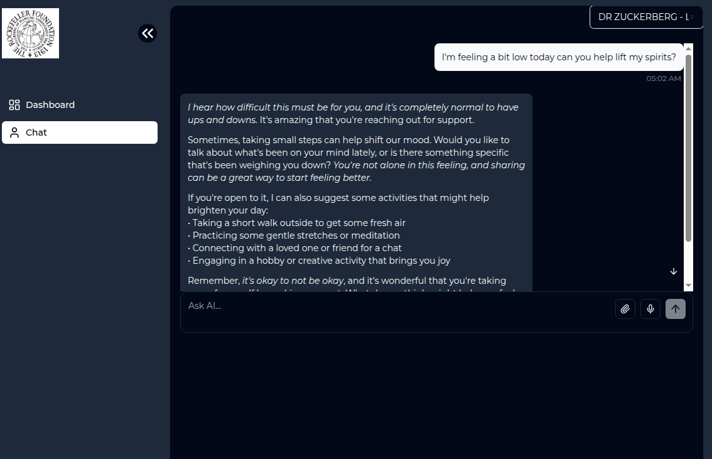

## Demo

<strong>Patient Dashboard and AI Support Assistant</strong>

Built with the Vite + React Ts + Vite Express Ts

 

<a href="https://patient-tracker-0gky.onrender.com/">View Demo</a>

## Overview

This is a starter template using the following stack:

- Js Library - [React 18](https://react.dev/)
- Language - [TypeScript](https://www.typescriptlang.org)
- Styling - [Tailwind CSS](https://tailwindcss.com)
- Components - [Shadcn-ui](https://ui.shadcn.com)
- Vite-Express

## Pages

| Pages                                                   | Specifications                            |
| :------------------------------------------------------ | :---------------------------------------- |
| [Dashboard](https://patient-tracker-0gky.onrender.com/) | Dashboard interactive graphs for patients |
| [Chat](https://patient-tracker-0gky.onrender.com/ai)    | Chat with your favorate support assosiate |
| [404](https://patient-tracker-0gky.onrender.com/404)    | Not Found Page                            |

## Getting Started

Follow these steps to clone the repository and start the development server:

- `git clone https://patient-tracker-0gky.onrender.com`
- `pnpm i`
- `npx tsx server/index.ts`

You should now be able to access the application at http://localhost:3000.

### Run Docker

- `docker build -t patient-tracker-app .`
- `docker run -p 3000:3000 -e GROQ_API_KEY=`
